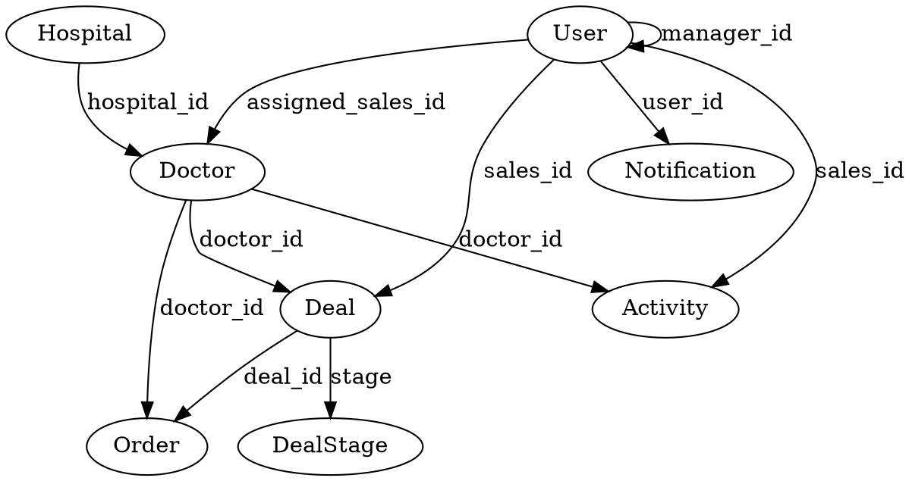

# Sales Execution System - Design Specification

**Document Version**: 1.0
**Date**: 2026-04-24
**Status**: Draft - Awaiting User Review

---

## 1. Overview

### 1.1 Purpose

Build a full production-ready **Sales Execution System** for a B2B medical sales team selling silicone scar sheets and scar cream to doctors and hospitals. The system tracks daily sales activities, manages doctor relationships, monitors deal pipeline, measures performance, prevents fake activity, and drives revenue.

### 1.2 Deployment Targets

| Parameter | Value |
|-----------|-------|
| Database | SQLite (cross-platform, embedded) |
| Backend | ASP.NET Core .NET 8 |
| Frontend | React + TypeScript + TailwindCSS |
| Deployment | IIS on Windows Server |
| Auth | JWT |

### 1.3 System Scope

**9 Core Modules** (built in 3 phases):

| Phase | Modules | Description |
|-------|---------|-------------|
| **Phase 1** | Auth + Doctors + Hospitals + Basic Dashboard | Core identity + doctor management |
| **Phase 2** | Activities + Deals + Orders + Pipeline | Sales execution workflow |
| **Phase 3** | KPI + Notifications + AI Suggestions + Advanced Dashboard | Intelligence layer |

---

## 2. User Roles & Permissions

### 2.1 Role Hierarchy

```
Admin (CEO)
  └── Sales Manager
        └── Sales Member
```

### 2.2 Role Definitions

| Role | Permissions |
|------|-------------|
| **Admin (CEO)** | Full access to all modules, all reports, user management |
| **Sales Manager** | View team performance, assign doctors to sales members, manage team |
| **Sales Member** | Manage own doctors, log activities, manage own deals |

### 2.3 User Entity

```
Users:
  - id: GUID (primary key)
  - username: string (unique)
  - email: string (unique)
  - password_hash: string (bcrypt)
  - full_name: string
  - role: enum (Admin, SalesManager, SalesMember)
  - manager_id: GUID? (nullable, for SalesMember → SalesManager relationship)
  - created_at: datetime
  - updated_at: datetime
  - is_active: bool (default: true)
```

---

## 3. Data Model

### 3.1 Hospital Entity

```
Hospitals:
  - id: GUID (primary key)
  - name: string (required)
  - address: string
  - created_at: datetime
  - updated_at: datetime
```

### 3.2 Doctor Entity

```
Doctors:
  - id: GUID (primary key)
  - name: string (required)
  - specialty: string
  - phone: string (unique, required)
  - zalo: string (optional)
  - hospital_id: GUID (foreign key → Hospitals)
  - address: string
  - potential_level: enum (A, B, C)
  - assigned_sales_id: GUID (foreign key → Users, nullable)
  - created_at: datetime
  - updated_at: datetime
```

**Business Rules:**
- Phone number must be unique (prevent duplicate doctors)
- A doctor can only be assigned to one Sales Member
- Potential levels: A (high value), B (medium), C (low)

### 3.3 Activity Entity

```
Activities:
  - id: GUID (primary key)
  - sales_id: GUID (foreign key → Users)
  - doctor_id: GUID (foreign key → Doctors)
  - type: enum (CALL, MESSAGE, MEETING, DEMO, SAMPLE_SENT)
  - content: string (text description)
  - result: enum (interested, not_interested, follow_up)
  - next_follow_up_date: datetime? (nullable)
  - checkin_lat: decimal? (optional GPS latitude)
  - checkin_lng: decimal? (optional GPS longitude)
  - image_url: string? (optional evidence photo)
  - created_at: datetime
```

**Business Rules:**
- Sales must log daily activities
- GPS validation is optional (configurable)
- Detect duplicate spam logs (same doctor + same type + same day)
- next_follow_up_date used for follow-up reminders

### 3.4 Deal Entity

```
Deals:
  - id: GUID (primary key)
  - doctor_id: GUID (foreign key → Doctors)
  - sales_id: GUID (foreign key → Users)
  - product: enum (SCAR_SHEET, SCAR_CREAM, BOTH)
  - value: decimal (deal value in VND)
  - expected_close_date: datetime
  - probability: int (0-100)
  - stage: enum (NEW, IN_PROGRESS, NEGOTIATION, WON, LOST)
  - notes: string? (optional)
  - created_at: datetime
  - updated_at: datetime
```

**Stage Transitions:**
```
Lead → Contacted → Consulted → Trial → Negotiation → WON (Order)
                                                    ↘ LOST
```

**Business Rules:**
- When stage changes to WON → auto-create Order
- Probability auto-updates based on stage:
  - NEW: 10%
  - IN_PROGRESS: 30%
  - NEGOTIATION: 70%
  - WON: 100%
  - LOST: 0%

### 3.5 Order Entity

```
Orders:
  - id: GUID (primary key)
  - deal_id: GUID (foreign key → Deals, required)
  - doctor_id: GUID (foreign key → Doctors)
  - product: enum (SCAR_SHEET, SCAR_CREAM, BOTH)
  - quantity: int
  - price: decimal (unit price in VND)
  - total_value: decimal (calculated: quantity × price)
  - status: enum (pending, shipped, completed)
  - created_at: datetime
  - updated_at: datetime
```

### 3.6 Notification Entity

```
Notifications:
  - id: GUID (primary key)
  - user_id: GUID (foreign key → Users)
  - type: enum (follow_up_reminder, deal_closing, inactive_alert)
  - title: string
  - message: string
  - reference_id: GUID? (optional, e.g., deal_id, doctor_id)
  - is_read: bool (default: false)
  - created_at: datetime
```

---

## 4. API Specification

### 4.1 Authentication

| Method | Endpoint | Description | Auth |
|--------|----------|-------------|------|
| POST | `/api/auth/login` | Login with username/password | Public |
| POST | `/api/auth/register` | Register new user (Admin only) | Admin |
| GET | `/api/auth/me` | Get current user profile | JWT |

### 4.2 Users

| Method | Endpoint | Description | Auth |
|--------|----------|-------------|------|
| GET | `/api/users` | List all users | Admin |
| GET | `/api/users/{id}` | Get user by ID | JWT |
| PUT | `/api/users/{id}` | Update user | Admin/self |
| DELETE | `/api/users/{id}` | Delete user (soft delete) | Admin |
| GET | `/api/users/sales-members` | List sales members | Manager+ |

### 4.3 Doctors

| Method | Endpoint | Description | Auth |
|--------|----------|-------------|------|
| GET | `/api/doctors` | List doctors (paginated, filterable) | JWT |
| GET | `/api/doctors/{id}` | Get doctor by ID | JWT |
| POST | `/api/doctors` | Create doctor | SalesMember+ |
| PUT | `/api/doctors/{id}` | Update doctor | SalesMember+ |
| DELETE | `/api/doctors/{id}` | Delete doctor | Manager+ |
| GET | `/api/doctors/assigned` | Get assigned doctors | SalesMember |
| PUT | `/api/doctors/{id}/assign` | Assign doctor to sales | Manager |

### 4.4 Hospitals

| Method | Endpoint | Description | Auth |
|--------|----------|-------------|------|
| GET | `/api/hospitals` | List hospitals | JWT |
| GET | `/api/hospitals/{id}` | Get hospital by ID | JWT |
| POST | `/api/hospitals` | Create hospital | Manager+ |
| PUT | `/api/hospitals/{id}` | Update hospital | Manager+ |
| DELETE | `/api/hospitals/{id}` | Delete hospital | Admin |

### 4.5 Activities

| Method | Endpoint | Description | Auth |
|--------|----------|-------------|------|
| GET | `/api/activities` | List activities (paginated, filterable) | JWT |
| GET | `/api/activities/{id}` | Get activity by ID | JWT |
| POST | `/api/activities` | Log new activity | SalesMember+ |
| PUT | `/api/activities/{id}` | Update activity | Owner |
| DELETE | `/api/activities/{id}` | Delete activity | Manager+ |
| GET | `/api/activities/today` | Get today's activities for current user | JWT |
| GET | `/api/activities/doctor/{doctorId}` | Get activities for doctor | JWT |

**Anti-Spam Rules:**
- If same doctor + same type + same day → reject as duplicate
- Require minimum 30-minute gap between same-type activities for same doctor

### 4.6 Deals

| Method | Endpoint | Description | Auth |
|--------|----------|-------------|------|
| GET | `/api/deals` | List deals (paginated, filterable) | JWT |
| GET | `/api/deals/{id}` | Get deal by ID | JWT |
| POST | `/api/deals` | Create deal | SalesMember+ |
| PUT | `/api/deals/{id}` | Update deal (including stage change) | SalesMember+ |
| DELETE | `/api/deals/{id}` | Delete deal | Manager+ |
| GET | `/api/deals/my` | Get current user's deals | SalesMember |
| PUT | `/api/deals/{id}/stage` | Update deal stage only | SalesMember+ |

**Stage → Order Automation:**
- When PUT `/api/deals/{id}/stage` with stage=WON:
  - Auto-create Order with deal_id, doctor_id, product, quantity (from deal notes), price (from config)
  - Return the created order in response

### 4.7 Orders

| Method | Endpoint | Description | Auth |
|--------|----------|-------------|------|
| GET | `/api/orders` | List orders (paginated, filterable) | JWT |
| GET | `/api/orders/{id}` | Get order by ID | JWT |
| PUT | `/api/orders/{id}` | Update order (status change) | SalesMember+ |
| GET | `/api/orders/deal/{dealId}` | Get order by deal ID | JWT |

### 4.8 Dashboard

| Method | Endpoint | Description | Auth |
|--------|----------|-------------|------|
| GET | `/api/dashboard/ceo` | CEO full dashboard data | Admin |
| GET | `/api/dashboard/manager` | Manager team dashboard | Manager |
| GET | `/api/dashboard/sales` | Sales personal dashboard | SalesMember |

**CEO Dashboard Response:**
```json
{
  "totalRevenue": 150000000,
  "revenueBySales": [{ "salesName": "...", "revenue": 50000000 }],
  "topDoctors": [{ "name": "...", "totalValue": 10000000 }],
  "conversionRate": 0.25,
  "pipelineValue": { "NEW": 50000000, "IN_PROGRESS": 100000000 },
  "activeDealsCount": 45,
  "inactiveSalesCount": 2
}
```

**Manager Dashboard Response:**
```json
{
  "teamActivitiesToday": [{ "salesName": "...", "activityCount": 5 }],
  "inactiveSales": [{ "salesName": "...", "lastActivityDate": "..." }],
  "dealsClosingSoon": [{ "doctorName": "...", "expectedCloseDate": "..." }]
}
```

**Sales Dashboard Response:**
```json
{
  "todayTasks": [{ "doctorName": "...", "activityType": "CALL", "scheduledTime": "..." }],
  "myDeals": [{ "doctorName": "...", "stage": "NEGOTIATION", "value": 5000000 }],
  "kpiProgress": { "callsToday": 8, "callsTarget": 10, "meetingsThisWeek": 3 }
}
```

### 4.9 KPI

| Method | Endpoint | Description | Auth |
|--------|----------|-------------|------|
| GET | `/api/kpi/sales/{salesId}` | Get KPI for specific sales member | Manager+ |
| GET | `/api/kpi/team` | Get team KPI summary | Manager |
| GET | `/api/kpi/global` | Get global KPI | Admin |

**KPI Metrics:**
- calls_per_day: count of CALL activities today
- meetings_per_week: count of MEETING activities this week
- conversion_rate: deals WON / total deals
- revenue_per_sales: total order value per sales member
- deal_aging: average days from NEW to WON/LOST

### 4.10 Notifications

| Method | Endpoint | Description | Auth |
|--------|----------|-------------|------|
| GET | `/api/notifications` | List user's notifications | JWT |
| PUT | `/api/notifications/{id}/read` | Mark notification as read | JWT |
| PUT | `/api/notifications/read-all` | Mark all as read | JWT |

---

## 5. Architecture

### 5.1 Backend Structure (Clean Architecture)

```
/backend
  /Controllers
    - AuthController.cs
    - UsersController.cs
    - DoctorsController.cs
    - HospitalsController.cs
    - ActivitiesController.cs
    - DealsController.cs
    - OrdersController.cs
    - DashboardController.cs
    - KpiController.cs
    - NotificationsController.cs
  /Services
    - IAuthService.cs + AuthService.cs
    - IUserService.cs + UserService.cs
    - IDoctorService.cs + DoctorService.cs
    - IHospitalService.cs + HospitalService.cs
    - IActivityService.cs + ActivityService.cs
    - IDealService.cs + DealService.cs
    - IOrderService.cs + OrderService.cs
    - IDashboardService.cs + DashboardService.cs
    - IKpiService.cs + KpiService.cs
    - INotificationService.cs + NotificationService.cs
  /Repositories
    - IRepository.cs + Repository.cs (generic base)
    - IUserRepository.cs + UserRepository.cs
    - IDoctorRepository.cs + DoctorRepository.cs
    - IHospitalRepository.cs + HospitalRepository.cs
    - IActivityRepository.cs + ActivityRepository.cs
    - IDealRepository.cs + DealRepository.cs
    - IOrderRepository.cs + OrderRepository.cs
    - INotificationRepository.cs + NotificationRepository.cs
  /Entities
    - User.cs
    - Doctor.cs
    - Hospital.cs
    - Activity.cs
    - Deal.cs
    - Order.cs
    - Notification.cs
  /DTOs
    /Request
      - LoginRequest.cs
      - CreateDoctorRequest.cs
      - CreateActivityRequest.cs
      - CreateDealRequest.cs
      - UpdateDealStageRequest.cs
    /Response
      - LoginResponse.cs
      - DoctorResponse.cs
      - ActivityResponse.cs
      - DealResponse.cs
      - DashboardResponse.cs
  /Data
    - AppDbContext.cs (EF Core DbContext)
  /Migrations
    - Auto-generated by EF Core
  /Middleware
    - JwtMiddleware.cs
    - ExceptionMiddleware.cs
  Program.cs
  appsettings.json
```

### 5.2 Frontend Structure

```
/frontend
  /src
    /components
      /common
        - Button.tsx
        - Card.tsx
        - Input.tsx
        - Select.tsx
        - Table.tsx
        - Modal.tsx
        - Sidebar.tsx
        - TopBar.tsx
      /dashboard
        - CEODashboard.tsx
        - ManagerDashboard.tsx
        - SalesDashboard.tsx
      /doctors
        - DoctorList.tsx
        - DoctorForm.tsx
        - DoctorCard.tsx
      /activities
        - ActivityList.tsx
        - ActivityForm.tsx
      /deals
        - DealList.tsx
        - DealForm.tsx
        - DealPipeline.tsx
      /orders
        - OrderList.tsx
    /pages
      - Login.tsx
      - Dashboard.tsx
      - Doctors.tsx
      - DoctorDetail.tsx
      - Activities.tsx
      - Deals.tsx
      - Orders.tsx
      - Settings.tsx
      - NotFound.tsx
    /services
      - api.ts (Axios instance)
      - authService.ts
      - doctorService.ts
      - activityService.ts
      - dealService.ts
      - orderService.ts
      - dashboardService.ts
    /store
      - authStore.ts (Zustand)
      - doctorStore.ts
      - activityStore.ts
      - dealStore.ts
    /layouts
      - MainLayout.tsx
    /types
      - index.ts (all TypeScript interfaces)
    App.tsx
    main.tsx
  package.json
  tailwind.config.js
  vite.config.ts
```

### 5.3 Database Schema (SQLite)

Using Entity Framework Core with SQLite provider:

- All entities have GUID primary keys
- Foreign key relationships enforced at EF Core level
- Unique constraints via Fluent API
- Indexes on frequently queried columns (sales_id, doctor_id, created_at)

---

## 6. Security

### 6.1 Authentication

- JWT tokens with 24-hour expiry
- Refresh token support (optional for Phase 1)
- Passwords hashed with BCrypt (cost factor: 12)

### 6.2 Authorization

- Role-based access control (RBAC) middleware
- Each endpoint checks user role before processing
- SalesMember can only access own data (their doctors, activities, deals)

### 6.3 Input Validation

- All DTOs have data annotations ([Required], [StringLength], etc.)
- Request size limits configured
- SQL injection prevented via EF Core parameterization

---

## 7. Seed Data

On first run (database creation), seed:

### 7.1 Users

| Username | Password | Role | Full Name |
|----------|----------|------|-----------|
| admin | Admin123! | Admin | Nguyễn CEO |
| manager1 | Manager123! | SalesManager | Trần Manager |
| manager2 | Manager123! | SalesManager | Lê Manager |
| sales1 | Sales123! | SalesMember | Minh Sales |
| sales2 | Sales123! | SalesMember | Hùng Sales |
| sales3 | Sales123! | SalesMember | Lan Sales |
| sales4 | Sales123! | SalesMember | Chi Sales |
| sales5 | Sales123! | SalesMember | Phong Sales |

### 7.2 Hospitals

| Name | Address |
|------|---------|
| Bệnh viện Da liễu Trung ương | Hà Nội |
| Bệnh viện Chợ Rẫy | TP.HCM |
| Bệnh viện Đại học Y Hà Nội | Hà Nội |
| Bệnh viện Nhi Trung ương | Hà Nội |
| Bệnh viện Tai Mũi Họng | TP.HCM |

### 7.3 Doctors

15-20 sample doctors with varied specialties, hospitals, and potential levels.

### 7.4 Sample Deals

5-10 sample deals in various stages.

---

## 8. AI Suggestions (Rule-Based)

### 8.1 Rules Engine

Implement as background service or cron job (runs daily at 8 AM):

| Rule | Condition | Action |
|------|-----------|--------|
| Follow-up reminder | Activity with doctor > 7 days ago AND no pending deal | Create notification: "Follow up with Dr. X" |
| Hot deal flag | Deal probability > 70% | Mark deal as "HOT" (visual indicator) |
| Inactive sales alert | Sales member has 0 activities today | Create notification to manager |

### 8.2 Implementation

- Create `AISuggestionService` with rule evaluation
- `IHostedService` implementation for daily cron job
- Configurable rule thresholds (in appsettings.json)

---

## 9. UI/UX Specification

### 9.1 Visual Style: Modern Colorful

**Color Palette:**
| Purpose | Color | Hex |
|---------|-------|-----|
| Primary | Blue | #3B82F6 |
| Secondary | Indigo | #6366F1 |
| Accent | Emerald | #10B981 |
| Success | Green | #22C55E |
| Warning | Amber | #F59E0B |
| Danger | Red | #EF4444 |
| Background | Slate 50 | #F8FAFC |
| Surface | White | #FFFFFF |
| Text Primary | Slate 900 | #0F172A |
| Text Secondary | Slate 500 | #64748B |

### 9.2 Layout Structure

```
┌─────────────────────────────────────────────────────────────┐
│  TopBar: Logo | Search | Notifications | User Menu         │
├──────────┬──────────────────────────────────────────────────┤
│          │                                                  │
│  Sidebar │              Main Content Area                   │
│  (240px) │                                                  │
│          │  ┌─────────────────────────────────────────┐    │
│  - Dashboard                                                 │
│  - Doctors│    Dashboard Card Grid (responsive)         │
│  - Activities                                          │
│  - Deals  │    or Data Table with Filters              │
│  - Orders│                                               │
│  - Reports│   or Form (create/edit)                     │
│  - Settings                                              │
│          │                                                │
└──────────┴──────────────────────────────────────────────────┘
```

### 9.3 Key Components

**Sidebar Navigation:**
- Collapsible on mobile (hamburger menu)
- Active state: Primary color background with white text
- Icons for each module
- Role-based menu items (hidden for unauthorized roles)

**Dashboard Cards:**
- KPI metrics in colored cards (icon + number + label)
- Revenue chart: Bar chart by sales member
- Pipeline: Horizontal funnel visualization
- Recent activities: Timeline list

**Data Tables:**
- Sortable columns
- Filterable by status, date range, search text
- Pagination (10/20/50 per page)
- Row actions: View, Edit, Delete
- Bulk select for manager actions

**Forms:**
- Floating labels
- Inline validation messages
- Submit button with loading state
- Cancel button

**Deal Pipeline Board:**
- Kanban-style columns: NEW | IN_PROGRESS | NEGOTIATION | WON | LOST
- Drag-and-drop between stages
- Color-coded by stage
- Deal cards show: doctor name, value, probability, expected close date

---

## 10. Performance Requirements

### 10.1 Pagination

All list endpoints must support:
```
GET /api/resource?page=1&pageSize=20&sortBy=createdAt&sortOrder=desc
```

Response format:
```json
{
  "data": [...],
  "totalCount": 150,
  "page": 1,
  "pageSize": 20,
  "totalPages": 8
}
```

### 10.2 Query Optimization

- Indexes on foreign keys and created_at
- Avoid N+1 queries (use Include/Select)
- SQLite optimized for read-heavy workloads

### 10.3 Caching (Future)

- Redis caching for dashboard data (Phase 3 optimization)

---

## 11. Phase 1 Deliverables (Priority)

### 11.1 Backend (Phase 1)

- [ ] Project scaffolding with .NET 8 Web API
- [ ] EF Core with SQLite configuration
- [ ] User entity + BCrypt password hashing
- [ ] JWT authentication service
- [ ] Auth endpoints (login, register, me)
- [ ] Hospital CRUD
- [ ] Doctor CRUD with phone uniqueness check
- [ ] Role-based authorization middleware
- [ ] Seed data for users, hospitals, doctors
- [ ] Unit tests for core services

### 11.2 Frontend (Phase 1)

- [ ] React + Vite + TypeScript + TailwindCSS setup
- [ ] Axios API client with JWT interceptor
- [ ] Login page
- [ ] Main layout with sidebar
- [ ] Dashboard page (role-based views)
- [ ] Doctor list page
- [ ] Doctor create/edit form
- [ ] Hospital management (manager)

### 11.3 Infrastructure

- [ ] appsettings.json with connection string
- [ ] .env config file
- [ ] README with setup instructions

---

## 12. Open Questions

| Question | Resolution |
|----------|------------|
| GPS check-in required? | No - optional (configurable), Phase 2 |
| Image upload storage? | Local filesystem for Phase 1, S3/Cloud later |
| Refresh token behavior? | Phase 1: 24hr JWT only |
| Deal probability manual or auto? | Auto based on stage (configurable rules) |
| Notification delivery method? | In-app only for Phase 1 |
| Mobile app required? | No - web responsive only for Phase 1 |

---

## 13. Appendix: Entity Relationship Diagram



---

**End of Specification**

*Next Step: User review and approval of this spec before invoking writing-plans skill.*
